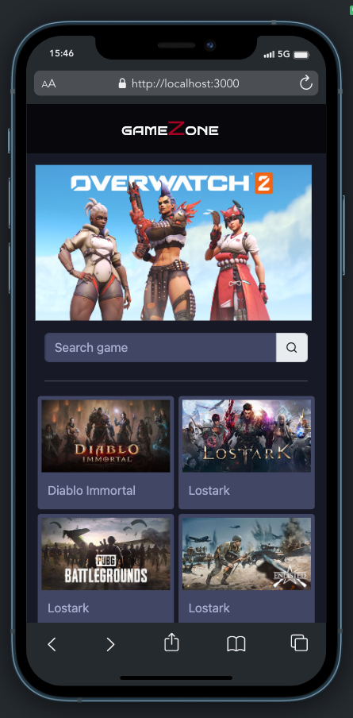
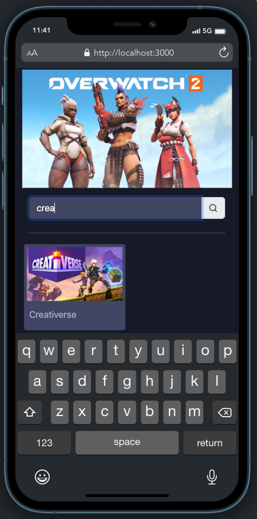
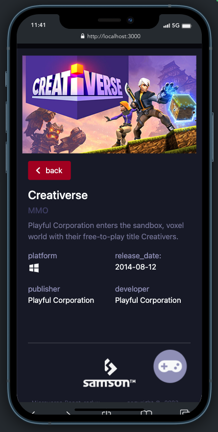

<a name="readme-top"></a>

<div align="center">
  
  <br/>

  <h3><b>gameZone</b></h3>
  
  <div margin-left="100"><table><tr><td width="33%" margin-left="100"><td width="33%"> </td><td width="33%" margin-left="100"></td></tr></table></div>

</div>

<!-- TABLE OF CONTENTS -->

# 📗 Table of Contents

- [📖 About the Project](#about-project)
  - [🛠 Built With](#built-with)
    - [Tech Stack](#tech-stack)
    - [Key Features](#key-features)
- [💻 Getting Started](#getting-started)
  - [Setup](#setup)
  - [Prerequisites](#prerequisites)
  - [Usage](#usage)
  - [Run tests](#run-tests)
- [👥 Authors](#authors)
- [🔭 Future Features](#future-features)
- [🤝 Contributing](#contributing)
- [⭐️ Show your support](#support)
- [🙏 Acknowledgements](#acknowledgements)
- [📝 License](#license)

<!-- PROJECT DESCRIPTION -->

# 📖 [gameZone] <a name="about-project"></a>

**[gameZone]** is a mobile application that gives information about video games and where you can play them and uses data from the [freetogameAPI](https://www.freetogame.com/api-doc).

## 🛠 Built With <a name="built-with"></a>

### Tech Stack <a name="tech-stack"></a>

<details>
  <summary>React</summary>
  <ul>
    <li><a href="https://reactjs.org/">React.js</a></li>
  </ul>
</details>

<details>
  <summary>Redux</summary>
  <ul>
    <li><a href="https://redux-toolkit.js.org">Redux</a></li>
  </ul>
</details>

<details>
  <summary>SCSS</summary>
  <ul>
    <li><a href="https://sass-lang.com">SCSS</a></li>
  </ul>
</details>

<details>
<summary>Bootstrap</summary>
  <ul>
    <li><a href="https://getbootstrap.com">Bootstrap</a></li>
  </ul>
</details>

<!-- Features -->

### Key Features <a name="key-features"></a>

- **[Display games from API]**
- **[Search for game]**
- **[Show more information about a game]**

<p align="right">(<a href="#readme-top">back to top</a>)</p>

<!-- LIVE DEMO 

## 🚀 Live Demo <a name="live-demo"></a>

- [Live Demo Link](https://google.com)

<p align="right">(<a href="#readme-top">back to top</a>)</p> -->

<!-- GETTING STARTED -->

## 💻 Getting Started <a name="getting-started"></a>

To get a local copy up and running, follow these steps.

### Prerequisites

In order to run this project you need:

Example command:

```
 npm install 
```

### Setup

Clone this repository to your desired folder:

```
  cd my-folder
  git clone https://github.com/SamTush/gamezone.git
```

### Usage

To run the project, execute the following command:

```
  npm start
```

### Run tests

To run tests, run the following command:

```
  npm run test
```

### Deployment

You can deploy this project using:

[Render](https://render.com)

<p align="right">(<a href="#readme-top">back to top</a>)</p>

<!-- AUTHORS -->

## 👥 Authors <a name="authors"></a>

👤 **Author1**

- GitHub: [@githubhandle](https://github.com/SamTush)

<p align="right">(<a href="#readme-top">back to top</a>)</p>

<!-- FUTURE FEATURES -->

## 🔭 Future Features <a name="future-features"></a>

- [ ] **[play games using the applicatio]**

<p align="right">(<a href="#readme-top">back to top</a>)</p>

<!-- CONTRIBUTING -->

## 🤝 Contributing <a name="contributing"></a>

Contributions, issues, and feature requests are welcome!

Feel free to check the [issues page](https://github.com/SamTush/gamezone/issues).

<p align="right">(<a href="#readme-top">back to top</a>)</p>

<!-- SUPPORT -->

## ⭐️ Show your support <a name="support"></a>

If you like this project, feel free to give it a star and contribute to make it better

<p align="right">(<a href="#readme-top">back to top</a>)</p>

<!-- ACKNOWLEDGEMENTS -->

## 🙏 Acknowledgments <a name="acknowledgements"></a>

I would like to thank Microverse for the opportunity to be part of the wonderful community.

<p align="right">(<a href="#readme-top">back to top</a>)</p>

<!-- LICENSE -->

## 📝 License <a name="license"></a>

This project is [MIT](./LICENSE) licensed.

<p align="right">(<a href="#readme-top">back to top</a>)</p>
